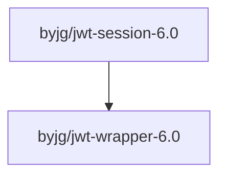

# Changelog - Version 6.0

## Overview

Version 6.0 is a major release that updates the library for modern PHP standards, improves compatibility with the latest jwt-wrapper library, and adds comprehensive documentation. This release includes breaking changes that require code updates when upgrading from version 4.x.

## New Features

### PHP 8.1+ Support
- Added support for PHP 8.1, 8.2, 8.3, and 8.4
- Upgraded to PHPUnit 10 and 11 for modern testing
- Added static analysis support with Psalm (versions 5.9 and 6.12)

### Enhanced Documentation
- **Getting Started Guide** (`docs/getting-started.md`) - Installation, basic usage, and motivation
- **Configuration Guide** (`docs/configuration.md`) - Comprehensive configuration options and examples
- **RSA Keys Guide** (`docs/rsa-keys.md`) - Using RSA private/public keys for enhanced security
- **How It Works** (`docs/how-it-works.md`) - Architecture and internal implementation details
- **Security Guide** (`docs/security.md`) - Security considerations and best practices
- **API Reference** (`docs/api-reference.md`) - Complete API documentation for all classes and methods

### Improved Code Quality
- Added PHP 8 attributes support (`#[Override]`)
- Implemented static data providers for PHPUnit 10+ compatibility
- Added comprehensive type hints throughout the codebase
- Suppressed expected warnings in session parsing with proper error handling

### Enhanced CI/CD
- Updated GitHub Actions workflow to test against PHP 8.1, 8.2, 8.3, and 8.4
- Added container options for better test isolation
- Improved build configuration for modern PHP versions

### Composer Scripts
- Added `composer test` script to run PHPUnit tests
- Added `composer psalm` script to run static analysis

## Bug Fixes

- Fixed `gc()` return type from `bool` to `int|false` to match `SessionHandlerInterface` requirements
- Removed redundant null coalescing operators for `getCookiePath()` calls
- Fixed compatibility with jwt-wrapper 6.0 API changes
- Updated session data handling to use array format for JWT token creation

## Breaking Changes

| Component | Before (4.x) | After (6.0) | Description |
|-----------|--------------|-------------|-------------|
| **PHP Version** | `php: ">=8.0"` | `php: ">=8.1 <8.5"` | Minimum PHP version raised to 8.1, added upper bound for PHP 8.4 |
| **jwt-wrapper Version** | `byjg/jwt-wrapper: "4.9.*"` | `byjg/jwt-wrapper: "^6.0"` | Updated to jwt-wrapper 6.0 with breaking API changes |
| **PHPUnit Version** | `phpunit/phpunit: "5.7.*\|7.4.*\|^9.6"` | `phpunit/phpunit: "^10\|^11"` | Upgraded to PHPUnit 10/11 (breaking for custom tests) |
| **Namespace** | `use ByJG\Util\JwtWrapper;` | `use ByJG\JwtWrapper\JwtWrapper;` | JWT wrapper classes moved to dedicated namespace |
| **Class Names** | `JwtKeySecret` | `JwtHashHmacSecret` | Renamed for clarity and consistency |
| **Class Names** | `JwtRsaKey` | `JwtOpenSSLKey` | Renamed for clarity and consistency |
| **JwtWrapper API** | `createJwtData($data, $timeout)` | `createJwtData(['data' => $data], $timeout, 0, null)` | JWT data must be an array, additional parameters required |
| **gc() Return Type** | `bool` | `int\|false` | Updated to match PHP's SessionHandlerInterface specification |
| **Test Data Providers** | Instance methods with `@dataProvider` | Static methods with `#[DataProvider]` attribute | PHPUnit 10+ requires static data providers |

## Upgrade Path from 5.x to 6.x

### Step 1: Update System Requirements

Ensure your environment meets the new requirements:
- PHP 8.1 or higher (up to PHP 8.4)
- Update your server or Docker containers if needed

### Step 2: Update Composer Dependencies

Update your `composer.json`:

```bash
composer require "byjg/jwt-session:^6.0"
composer require --dev "phpunit/phpunit:^10"  # If you have custom tests
```

### Step 3: Update Code - No Changes Required for Basic Usage

**Good news!** If you're using the library with basic configuration, no code changes are required:

```php
// This code works in both 4.x and 6.x
$sessionConfig = (new \ByJG\Session\SessionConfig('your.domain.com'))
    ->withSecret('your super base64url encoded secret key');

$handler = new \ByJG\Session\JwtSession($sessionConfig);
session_set_save_handler($handler, true);
```

### Step 4: Update Advanced Usage (If Applicable)

Only if you're directly using jwt-wrapper classes or extending the library:

**Before (4.x):**
```php
use ByJG\Util\JwtKeySecret;
use ByJG\Util\JwtRsaKey;
use ByJG\Util\JwtWrapper;

$key = new JwtKeySecret('secret');
$rsaKey = new JwtRsaKey($private, $public);
```

**After (6.0):**
```php
use ByJG\JwtWrapper\JwtHashHmacSecret;
use ByJG\JwtWrapper\JwtOpenSSLKey;
use ByJG\JwtWrapper\JwtWrapper;

$key = new JwtHashHmacSecret('secret');
$rsaKey = new JwtOpenSSLKey($private, $public);
```

### Step 5: Update Tests (If You Have Custom Tests)

If you have custom PHPUnit tests extending this library:

**Before (PHPUnit 9):**
```php
/**
 * @dataProvider myDataProvider
 */
public function testSomething($data)
{
    // test code
}

public function myDataProvider()
{
    return [['test']];
}
```

**After (PHPUnit 10/11):**
```php
#[DataProvider('myDataProvider')]
public function testSomething($data)
{
    // test code
}

public static function myDataProvider()
{
    return [['test']];
}
```

### Step 6: Run Tests

Verify everything works:

```bash
composer update
composer test    # New script in 6.0
composer psalm   # New script in 6.0 - optional but recommended
```

### Step 7: Review New Documentation

Review the new comprehensive documentation in the `docs/` folder to take advantage of new features and best practices.

## Migration Checklist

- [ ] Verify PHP version is 8.1 or higher
- [ ] Run `composer update` to get jwt-session 6.0 and jwt-wrapper 6.0
- [ ] Test your application with the updated dependencies
- [ ] If using advanced features, update namespace imports
- [ ] If extending the library or using jwt-wrapper directly, update class names
- [ ] If you have custom tests, update to PHPUnit 10+ syntax
- [ ] Review new security documentation
- [ ] Consider running Psalm for static analysis: `composer psalm`

## Notes

- **No runtime behavior changes**: Sessions work the same way in 6.0 as in 4.x
- **Backward compatible for standard usage**: Basic session configuration requires no code changes
- **JWT tokens remain compatible**: Existing sessions will continue to work after upgrade
- **Enhanced security**: Consider reviewing the new security documentation for best practices

## Dependencies

Updated dependency tree:



## Support

For issues, questions, or contributions, please visit:
- GitHub Issues: https://github.com/byjg/jwt-session/issues
- Documentation: See the `docs/` folder
- jwt-wrapper documentation: https://github.com/byjg/jwt-wrapper
